<p align="center"><a href="https://laravel.com" target="_blank"></a></p>

<p align="center">
<a href="https://github.com/laravel/framework/actions"></a>
<a href="https://packagist.org/packages/laravel/framework"></a>
<a href="https://packagist.org/packages/laravel/framework"></a>
<a href="https://packagist.org/packages/laravel/framework"></a>
</p>

## About Laravel

Laravel is a web application framework with expressive, elegant syntax. We believe development must be an enjoyable and creative experience to be truly fulfilling. Laravel takes the pain out of development by easing common tasks used in many web projects, such as:

- [Simple, fast routing engine](https://laravel.com/docs/routing).
- [Powerful dependency injection container](https://laravel.com/docs/container).
- Multiple back-ends for [session](https://laravel.com/docs/session) and [cache](https://laravel.com/docs/cache) storage.
- Expressive, intuitive [database ORM](https://laravel.com/docs/eloquent).
- Database agnostic [schema migrations](https://laravel.com/docs/migrations).
- [Robust background job processing](https://laravel.com/docs/queues).
- [Real-time event broadcasting](https://laravel.com/docs/broadcasting).

Laravel is accessible, powerful, and provides tools required for large, robust applications.

## Learning Laravel

Laravel has the most extensive and thorough [documentation](https://laravel.com/docs) and video tutorial library of all modern web application frameworks, making it a breeze to get started with the framework.

You may also try the [Laravel Bootcamp](https://bootcamp.laravel.com), where you will be guided through building a modern Laravel application from scratch.

If you don't feel like reading, [Laracasts](https://laracasts.com) can help. Laracasts contains thousands of video tutorials on a range of topics including Laravel, modern PHP, unit testing, and JavaScript. Boost your skills by digging into our comprehensive video library.

## Laravel Sponsors

We would like to extend our thanks to the following sponsors for funding Laravel development. If you are interested in becoming a sponsor, please visit the [Laravel Partners program](https://partners.laravel.com).

### Premium Partners

- **[Vehikl](https://vehikl.com/)**
- **[Tighten Co.](https://tighten.co)**
- **[WebReinvent](https://webreinvent.com/)**
- **[Kirschbaum Development Group](https://kirschbaumdevelopment.com)**
- **[64 Robots](https://64robots.com)**
- **[Curotec](https://www.curotec.com/services/technologies/laravel/)**
- **[Cyber-Duck](https://cyber-duck.co.uk)**
- **[DevSquad](https://devsquad.com/hire-laravel-developers)**
- **[Jump24](https://jump24.co.uk)**
- **[Redberry](https://redberry.international/laravel/)**
- **[Active Logic](https://activelogic.com)**
- **[byte5](https://byte5.de)**
- **[OP.GG](https://op.gg)**

## Contributing

Thank you for considering contributing to the Laravel framework! The contribution guide can be found in the [Laravel documentation](https://laravel.com/docs/contributions).

## Code of Conduct

In order to ensure that the Laravel community is welcoming to all, please review and abide by the [Code of Conduct](https://laravel.com/docs/contributions#code-of-conduct).

## Security Vulnerabilities

If you discover a security vulnerability within Laravel, please send an e-mail to Taylor Otwell via [taylor@laravel.com](mailto:taylor@laravel.com). All security vulnerabilities will be promptly addressed.

## License

The Laravel framework is open-sourced software licensed under the [MIT license](https://opensource.org/licenses/MIT).


# CinemaTicket

A web-based cinema ticket reservation system developed with Laravel and MySQL.

CinemaTicket allows users to browse movies, filter movies by genre, select a city and cinema, view available screening dates and times, choose seats, and reserve cinema tickets.

## Features

- User registration and login
- Browse available movies
- Filter movies by genre
- Search for cities and cinemas
- Select a city and cinema
- View movie screening dates and times
- Select available seats
- Reserve cinema tickets
- Generate a reservation receipt with a tracking code
- View previous purchases
- Edit or delete user account information
- Admin panel for managing system data

## Technologies

- PHP
- Laravel 11
- MySQL
- HTML
- CSS
- JavaScript
- Blade
- Eloquent ORM
- Bootstrap
- jQuery

## Architecture

The project follows the MVC (Model-View-Controller) architecture provided by Laravel.

- **Models:** Handle database entities and relationships.
- **Views:** Blade templates are used to display the user interface.
- **Controllers:** Handle application logic and user requests.

## Database

MySQL is used as the database management system.

The project uses Laravel Migrations and Seeders to create database tables and insert initial data.

Main entities include:

- Users
- Cities
- Cinemas
- Movies
- Showtimes
- Seats
- Reservations

## Security

The project uses Laravel's built-in security features, including:

- Password hashing
- Authentication
- Form validation
- CSRF protection

## Project Structure

```text
cinematicket/
├── app/
├── bootstrap/
├── config/
├── database/
│   ├── migrations/
│   └── seeders/
├── public/
├── resources/
│   └── views/
├── routes/
├── storage/
├── tests/
├── artisan
├── composer.json
└── package.json
```

## How to Run

### Requirements

- PHP
- Composer
- MySQL
- Laravel
- WAMP or XAMPP

### Installation

1. Clone the repository:
   
   ```
   git clone https://github.com/Reyhaneh04/cinematicket.git
   ```

2.Enter the project directory:

   ```
   cd cinematicket
   ```

3.Install PHP dependencies:

   ```
   composer install
```

4.Create the environment file:

   ```
   cp .env.example .env
```

5.Generate the Laravel application key:

   ```
   php artisan key:generate
```

6.Configure the database settings in .env:

   ```
   DB_CONNECTION=mysql
   DB_HOST=127.0.0.1
   DB_PORT=3306
   DB_DATABASE=cinematicket
   DB_USERNAME=root
   DB_PASSWORD=
```

7.Run migrations:

   ```
   php artisan migrate
```

8.Run seeders:

   ```
   php artisan db:seed
```

9.Start the Laravel development server:

   ```
   php artisan serve
   ```

10.Open the application in your browser:

   ```
   http://127.0.0.1:8000
```
## Screenshots

### Home Page

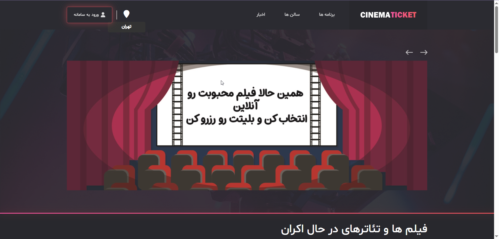

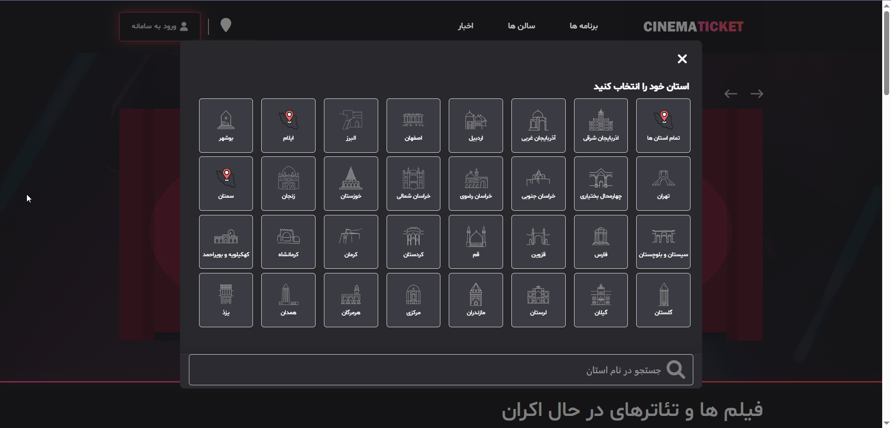

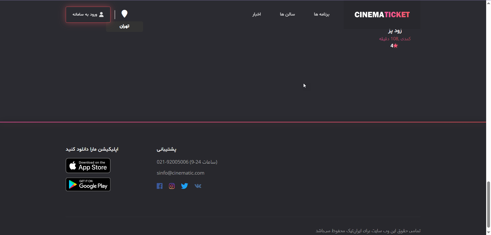

### Movies

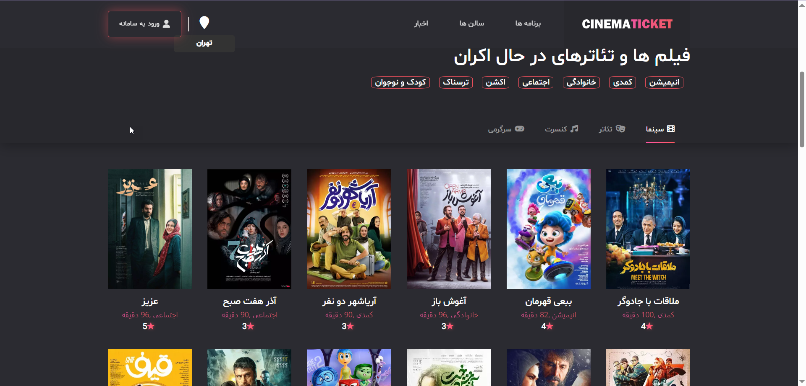

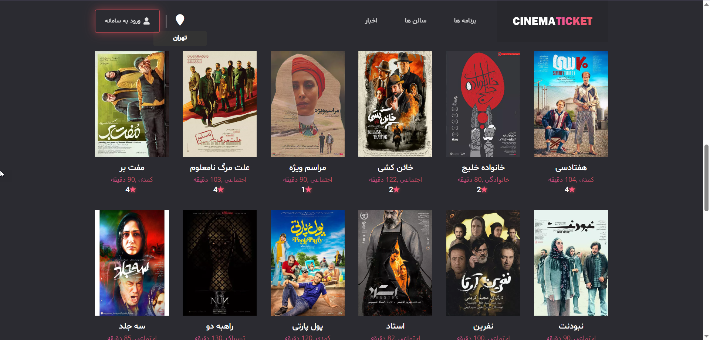

### Movie Details

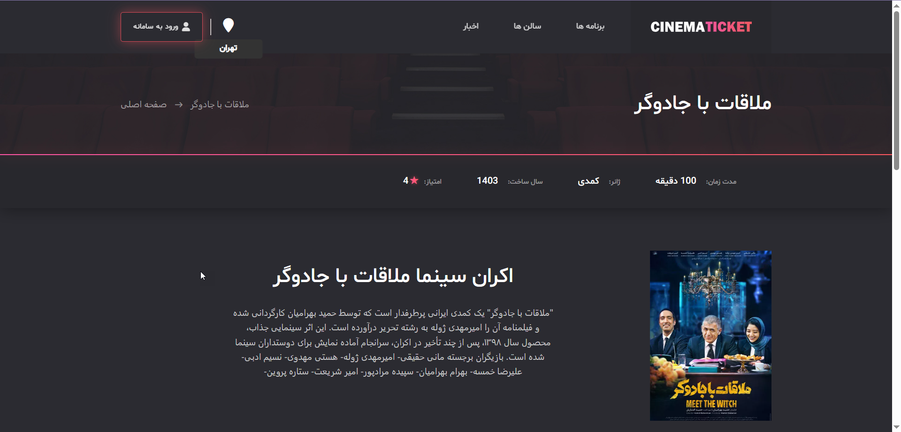

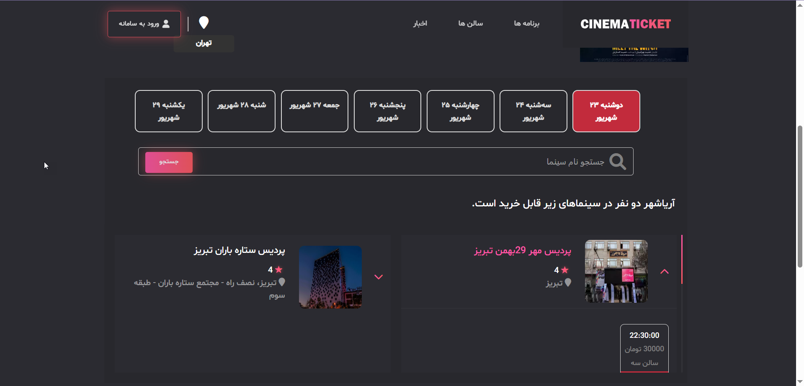

### Booking

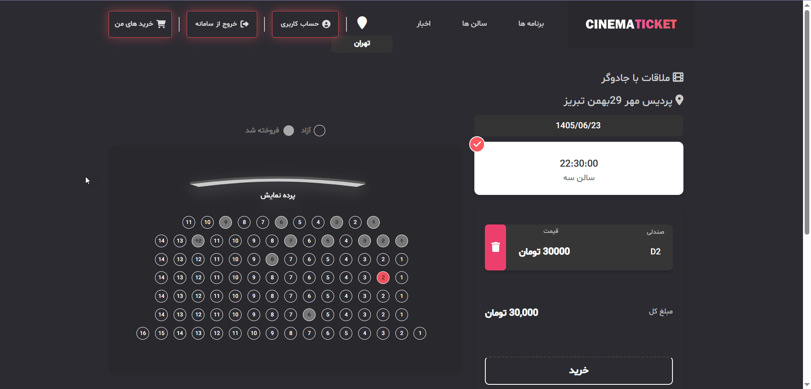

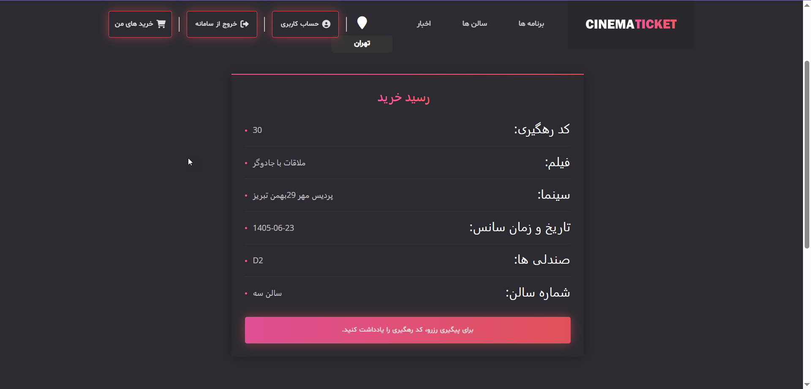

### Login

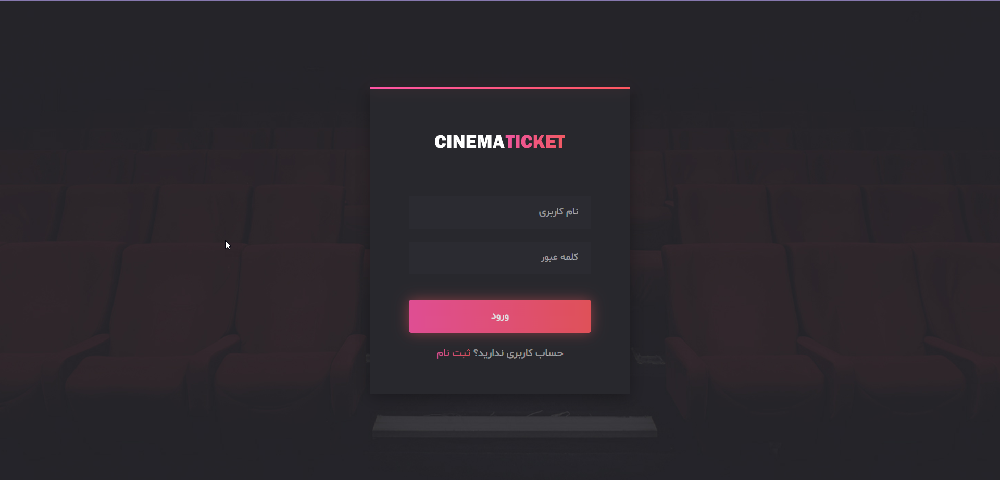

### Register

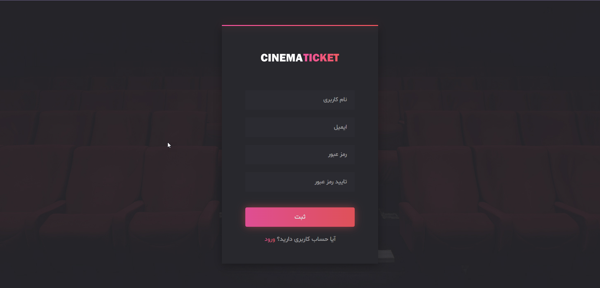

ننن
عاد

